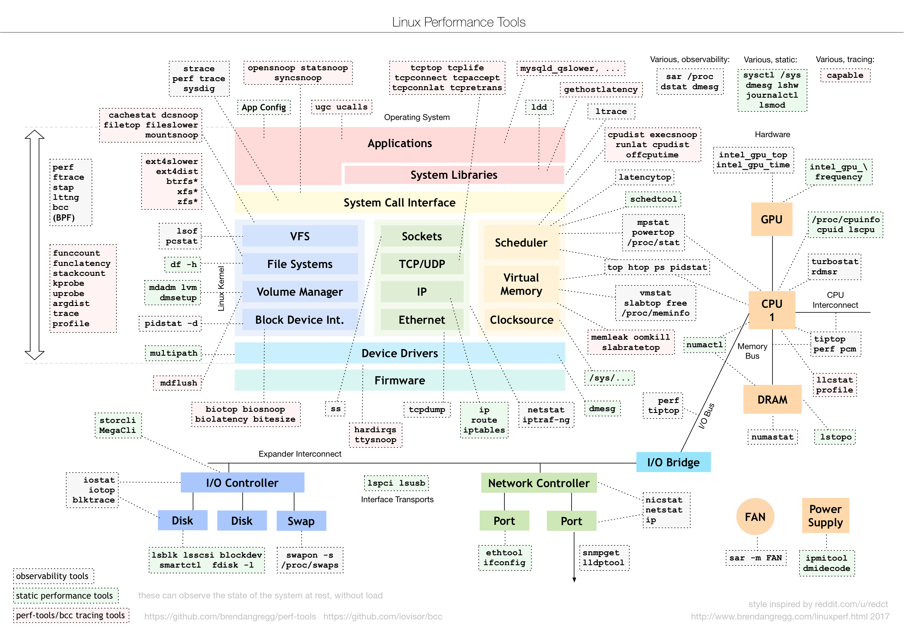

# 常用linux工具
## nm
列出指定文件中的符号（如常用的函数名、变量等，以及这些符号存储的区域）  
nm -C 函数名更具可读性  
https://blog.csdn.net/qq_36393978/article/details/124104635

## ltrace
跟踪库函数调用，底层使用ptrace  
https://zhuanlan.zhihu.com/p/22596610

## strace
监控用户空间进程和内核的交互，底层使用ptrace  
https://blog.csdn.net/itworld123/article/details/122961879

## ptrace
进程跟踪，利用父进程接收信号阻塞子进程，然后父进程检查修改子进程，子进程继续  
ptrace四参数(命令,pid,要监控的内存地址,存放读取出的或者要写入的数据)  
https://www.cnblogs.com/tangr206/articles/3094358.html

## ldd
ldd不是binary，是个shell脚本。显示可执行模块的dependency，其原理是通过设置一系列的环境变量  
LD_TRACE_LOADED_OBJECTS=1时，程序不执行，只显示依赖

## readelf
查看ELF格式的文件信息，包括linux上可执行文件及.so/.a等  
https://blog.csdn.net/yfldyxl/article/details/81566279  
patchelf可修改elf，例如写入依赖库路径 `--set-rpath "somepath"`

## man
帮助手册，`/partten`搜索错误信息

## file
查看文件类型及其编码格式，是否strip

关于rust链接库  
https://fasterthanli.me/articles/so-you-want-to-live-reload-rust

内核版本与glibc版本  
https://blog.csdn.net/itas109/article/details/124575454
  
